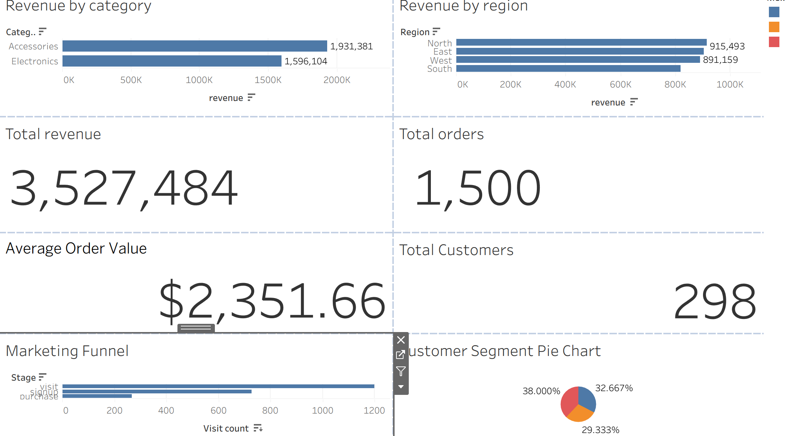

# Retail Sales Performance Dashboard

## Project Overview

This project analyzes retail sales data to uncover insights into revenue performance, product trends, category performance, and regional sales patterns.

The analysis was performed using Excel for data preparation and Tableau for creating an interactive dashboard. The goal of this project is to transform raw sales data into meaningful business insights that can support data-driven decision-making.

---

## Business Questions

- What are the overall sales and revenue trends?
- Which products generate the highest revenue?
- Which categories perform the best?
- Which regions contribute the most sales?
- How do discounts affect revenue and profitability?
- What insights can help improve sales performance?

---

## Dataset

The dataset contains retail transaction data with the following information:

- Order ID
- Order Date
- Product
- Category
- Price
- Quantity
- Discount
- Profit Margin
- Region
- Customer ID
- Revenue

The dataset was analyzed to understand sales performance, customer purchasing patterns, and business trends.

---

## Tools Used

- Microsoft Excel
- Tableau
- Data Cleaning
- Exploratory Data Analysis (EDA)
- Data Visualization
- Dashboard Development
- Business Intelligence Reporting

---

## Data Preparation

The dataset was prepared and analyzed by:

- Reviewing and organizing sales transaction data
- Checking data consistency and formatting
- Preparing fields for dashboard analysis
- Creating calculated metrics for business reporting
- Building visualizations to identify trends and patterns

---

## Dashboard Preview



---

## Key Insights

- Analyzed revenue performance across products, categories, and regions.
- Identified top-performing products and sales categories.
- Compared regional sales performance to understand business contribution.
- Created an interactive Tableau dashboard to monitor important sales metrics.
- Converted raw sales data into clear visual insights for decision-making.

---

## Project Files


```text
retail-sales-analysis/

├── README.md
├── sales_data.xlsx
├── retail-sales-performance-dashboard.twbx
└── retail-sales-dashboard.png
```

---

## Skills Demonstrated

- Data Analysis
- Excel Data Preparation
- Tableau Dashboard Development
- Data Visualization
- KPI Reporting
- Business Intelligence
- Exploratory Data Analysis
- Data Storytelling
